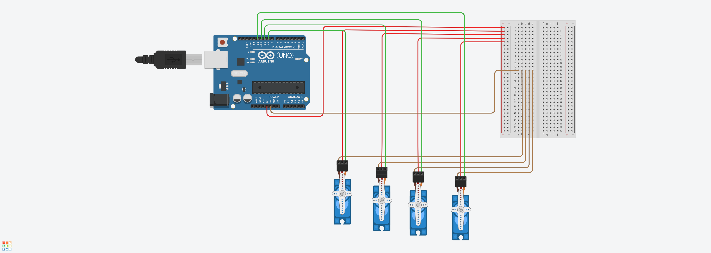

# 4 Servo Motors Sweeping

## Overview

This project demonstrates how to control four servo motors simultaneously using an Arduino Uno.

The servos perform a sweeping motion together for **2 seconds**, moving between **0° and 180°**, and then automatically return to the **90° (center) position**.

This project was created as part of an Arduino practice exercise using Tinkercad.

---

## Components

- Arduino Uno
- 4 × Servo Motors
- Breadboard
- Jumper Wires

---

## Features

- Controls four servo motors simultaneously.
- Uses the Arduino Servo library.
- Runs the sweep motion for exactly 2 seconds.
- Returns all servos to the center position (90°) after completion.
- Simple and easy-to-understand implementation.

---

## Project Structure

```
.
├── images/
│   └── circuit.png
├── 4_servo_motors_sweeping.ino
└── README.md
```

---

## Circuit Diagram



---

## How It Works

1. Four servo motors are attached to Arduino digital pins.
2. All servos move together between 0° and 180°.
3. The sweeping motion continues for 2 seconds.
4. After the time expires, all servos return to 90°.
5. The program finishes without repeating the motion.

---

## Technologies Used

- Arduino IDE
- C++
- Servo Library
- Tinkercad

---

## 👨‍💻 Author

**Nawaf Alharbi**
